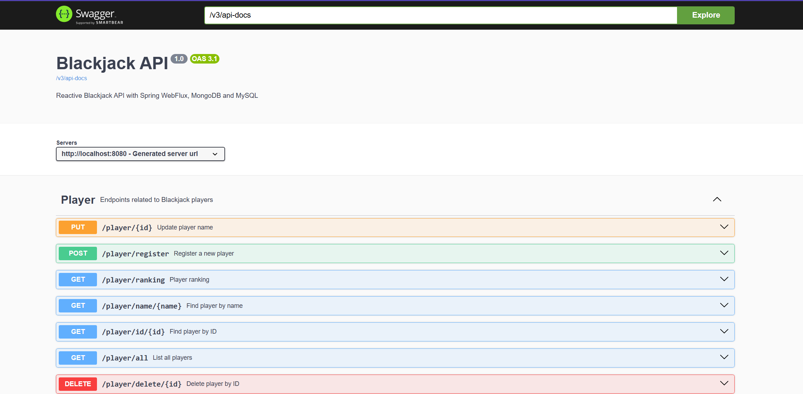
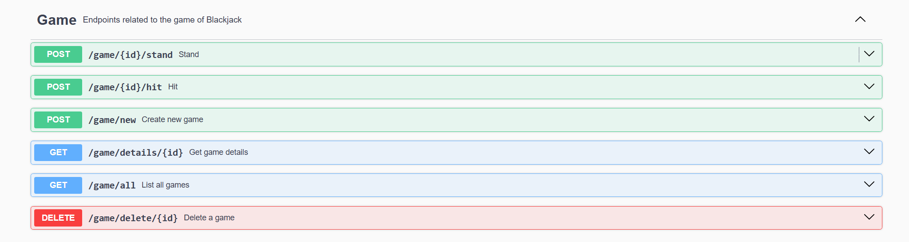
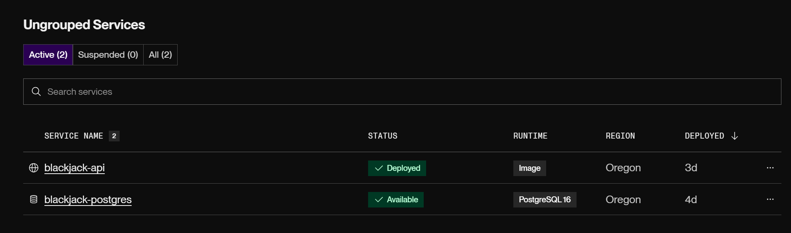
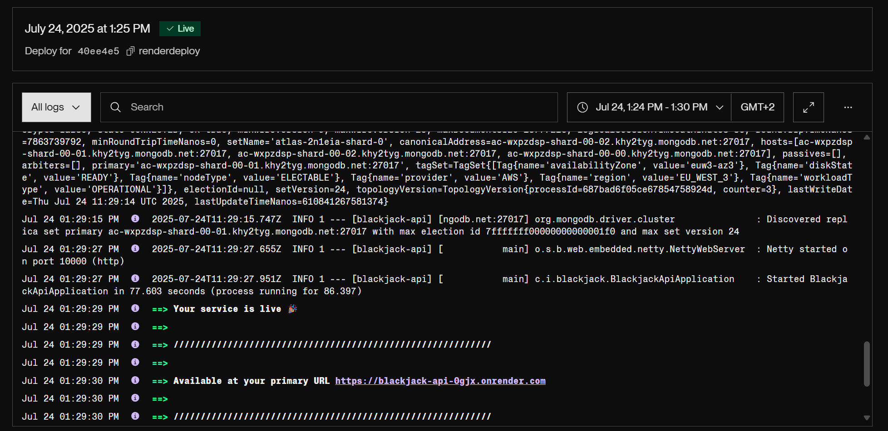

# 🃏 Blackjack API

## 📚 Table of Contents
- [🃏 Blackjack API](#-blackjack-api)
- [⚙️ Technical Requirements](#️-technical-requirements)
- [🏗 Architecture Overview](#-architecture-overview)
- [📡 API Endpoints & Usage Examples](#-api-endpoints--usage-examples)
- [🚀 Deployment & Execution](#-deployment--execution)
- [☁️ Deployment on Render](#-deployment-on-render)


Blackjack API is a backend application that simulates the classic card game of Blackjack with real game logic, reactive programming using Spring WebFlux, and persistence in both SQL (PostgreSQL) and NoSQL (MongoDB) databases. The project is designed as part of a backend development bootcamp and showcases clean architecture principles, professional design patterns (DTOs, mappers, services), and modern development tools.

The main features include:
- Player registration and ranking system
- Game creation with independent shuffled decks
- Realistic game flow: hit, stand, dealer logic
- Full REST API with Swagger documentation
- Dual persistence: reactive MongoDB for players, R2DBC PostgreSQL for games
- Dockerized and deployed on Render

This project is ideal for learning:
- Reactive programming with Spring WebFlux
- Integration of SQL and NoSQL in the same application
- Clean code practices and layered architecture
- Full API lifecycle: from creation to deployment


## ⚙️ Technical Requirements

To run and develop this project, the following technologies are required:

- **Java 21**
- **Maven** (for build and dependency management)
- **Spring Boot 3.x**
- **Spring WebFlux** (reactive programming)
- **R2DBC PostgreSQL** (reactive SQL persistence)
- **Reactive MongoDB** (NoSQL for players)
- **MapStruct** (for entity–DTO mapping)
- **Docker** (containerization)
- **Render** (deployment platform)

### Development Tools
- **Swagger / OpenAPI** (API documentation)
- **JUnit 5 + Mockito** (unit testing)
- **StepVerifier** (reactive flow testing)
- **Lombok** (code simplification)
- **Testcontainers** – Integration testing with real database containers
- **Git & GitHub** (version control)

## 🏗 Architecture Overview

The Blackjack API follows a layered architecture, ensuring clean separation of concerns:

S5.01.Advanced_Spring_Framework_with_WebFlux/
├── screenshots/
├── src/
│   ├── main/
│   │   ├── java/
│   │   │   └── cat/
│   │   │       └── itacademy/
│   │   │           └── blackjack/
│   │   │               ├── config/
│   │   │               ├── controller/
│   │   │               ├── dto/
│   │   │               ├── exception/
│   │   │               ├── mapper/
│   │   │               ├── model/
│   │   │               ├── repository/
│   │   │               │   ├── mongo/
│   │   │               │   └── sql/
│   │   │               └── service/
│   │   │                   ├── engine/
│   │   │                   └── logic/
│   │   └── resources/
│   └── test/
│       ├── java/
│       │   └── cat/
│       │       └── itacademy/
│       │           └── blackjack/
│       │               └── gameservice/
│       └── resources/
.
.
.

### 1. Controller Layer
- **Location:** `cat.itacademy.blackjack.controller`
- **Responsibilities:**
   - Exposes RESTful endpoints for `/player` and `/game`.
   - Handles incoming HTTP requests and responses.
   - Uses **DTOs** (`PlayerRequest`, `GameRequest`, etc.) for input validation and output formatting.
   - Delegates logic to the corresponding service layer (e.g. `PlayerService`, `GameService`).
- **Example classes:**
   - `PlayerController`
   - `GameController`

---

### 2. Service Layer
- **Location:** `cat.itacademy.blackjack.service`
- **Responsibilities:**
   - Contains business logic for player management, game flow (create, hit, stand), and ranking.
   - Coordinates domain operations, data transformation, and interaction with repositories.
   - Handles validations and throws custom exceptions like `PlayerNotFoundException`, `GameNotFoundException`, etc.
   - Composed of:
      - Core service interfaces (`PlayerService`, `GameService`)
      - Their implementations (`PlayerServiceImpl`, `GameServiceImpl`)
      - Sub-services like `GameCreationService`, `GameHitProcessor`, `DeckManager`, and `GameFactory` to modularize logic.
   - Emphasizes reactive and non-blocking logic using `Mono` and `Flux`.

---

### 3. Mapper Layer
- **Location:** `cat.itacademy.blackjack.mapper`
- **Responsibilities:**
   - Uses **MapStruct** to automatically map between:
      - Domain models ↔ DTOs
      - Nested structures like `Card` ↔ `CardResponseDTO`
   - Promotes clean separation of concerns by avoiding mapping logic in services or controllers.
   - Maintains strict control over exposed data in the API.

---

### 4. Repository Layer
- **Location:**
   - `cat.itacademy.blackjack.repository.mongo` → for MongoDB (Reactive)
   - `cat.itacademy.blackjack.repository.sql` → for PostgreSQL via R2DBC
- **Responsibilities:**
   - Provides persistence access for both types of data:
      - **Players** → MongoDB (`ReactiveMongoRepository`)
      - **Games** → PostgreSQL (`DatabaseClient`)
   - Abstracts the underlying storage details from the business logic.
   - Supports non-blocking database access using reactive repositories and SQL queries.

---

### 5. Model Layer
- **Location:** `cat.itacademy.blackjack.model`
- **Responsibilities:**
   - Defines the core domain entities:
      - `Player`, `Games`, `Card`, `CardValue`, `CardSuit`
   - Contains business-related enums like:
      - `GameStatus`, `GameTurn`, `CardSuit`, `CardValue`
   - These models serve as the foundation for both persistence and logic across the application.


### **High-Level Flow**

### 📌 Player Creation Flow
```plaintext
+-------------+
|   Client    |
+-------------+
      |
      v
POST /player/register (PlayerRequest)
      |
      v
+------------------+
| PlayerController |
+------------------+
      |
      v
+----------------+
| PlayerService  |
+----------------+
      |
      v
+----------------+
| PlayerMapper   |
| toEntity()     |
+----------------+
      |
      v
+--------------------+
| PlayerRepository   |
| (Reactive MongoDB) |
+--------------------+
      |
      v
+-------------+
|  MongoDB    |
+-------------+
      |
      v
+----------------+
| PlayerMapper   |
| toResponse()   |
+----------------+
      |
      v
<-- 201 Created (PlayerResponse)

```
### 📌 Game Creation Flow

```plaintext
+-------------+
|   Client    |
+-------------+
        |
        v
POST /games (playerId)
        |
        v
+-----------------+
| GameController  |
+-----------------+
        |
        v
+----------------+
| GameService    |
+----------------+
        |
        v
+------------------------+
| GameCreationService    |
+------------------------+
        |
        v
+---------------+     +----------------+
| DeckManager   | --> | Shuffled Deck  |
+---------------+     +----------------+
        |
        v
+------------------+
| GameFactory      |
| createNewGame()  |
+------------------+
        |
        v
+-------------------+
| GameRepository    |
| (R2DBC PostgreSQL)|
+-------------------+
        |
        v
+--------------+
| PostgreSQL   |
+--------------+
        |
        v
+-----------------+
| GameMapper      |
| toResponse()    |
+-----------------+
        |
        v
<-- 201 Created (GameResponse)
```

## 📡 API Endpoints & Usage Examples

The Blackjack API exposes the following REST endpoints grouped into two main domains: **Player** and **Game**.

---

### 👤 Player Endpoints

#### 🔹 Register a New Player
**POST** `/player/register`

```bash
# Request Body:
# {
#   "name": "Alex"
# }

curl -X POST http://localhost:8080/player/register \
  -H "Content-Type: application/json" \
  -d '{"name":"Alex"}'
```

---

#### 🔹 Get Player by ID
**GET** `/player/id/{id}`

```bash
curl http://localhost:8080/player/id/64abc123def456
```

---

#### 🔹 Get Player by Name
**GET** `/player/name/{name}`

```bash
curl http://localhost:8080/player/name/Alex
```

---

#### 🔹 Update Player Name
**PUT** `/player/{id}`

```bash
# Request Body:
# {
#   "newName": "Alejandro"
# }

curl -X PUT http://localhost:8080/player/64abc123def456 \
  -H "Content-Type: application/json" \
  -d '{"newName":"Alejandro"}'
```

---

#### 🔹 Delete Player
**DELETE** `/player/delete/{id}`

```bash
curl -X DELETE http://localhost:8080/player/delete/64abc123def456
```

---

#### 🔹 Get All Players
**GET** `/player/all`

```bash
curl http://localhost:8080/player/all
```

---

#### 🔹 Get Player Ranking
**GET** `/player/ranking`

```bash
curl http://localhost:8080/player/ranking
```

---

### 🃏 Game Endpoints

#### 🔹 Create a New Game
**POST** `/game/new`

```bash
# Request Body:
# {
#   "playerName": "Alex"
# }

curl -X POST http://localhost:8080/game/new \
  -H "Content-Type: application/json" \
  -d '{"playerName":"Alex"}'
```

---

#### 🔹 Get Game by ID
**GET** `/game/details/{id}`

```bash
curl http://localhost:8080/game/details/1
```

---

#### 🔹 Delete a Game
**DELETE** `/game/delete/{id}`

```bash
curl -X DELETE http://localhost:8080/game/delete/1
```

---

#### 🔹 Get All Games
**GET** `/game/all`

```bash
curl http://localhost:8080/game/all
```

---

#### 🔹 Hit (Draw card)
**POST** `/game/{id}/hit`

```bash
curl -X POST http://localhost:8080/game/1/hit
```

---

#### 🔹 Stand (End turn)
**POST** `/game/{id}/stand`

```bash
curl -X POST http://localhost:8080/game/1/stand
```

---

### 🧪 API Testing

You can interact with all endpoints using:

- **Swagger UI**:  
  http://localhost:8080/swagger-ui.html

- **Postman / HTTPie / Curl**





## 🚀 Deployment & Execution

This section explains how to run the Blackjack API locally using Docker and how to deploy it on Render.

---

## 🚀 Deployment & Execution with Docker Compose

This application is fully containerized and can be launched using `docker-compose`. It includes:

- A **Reactive REST API** built with Spring Boot and Java 21
- A **PostgreSQL** database for game storage (via R2DBC)
- A **MongoDB** database for player data
- A **custom script** to wait for PostgreSQL before running the API
- A **command-line initializer** that creates the required table on startup

---

### 🐳 docker-compose.yml

```yaml
version: "3.8"

services:
  mongo_blackjack:
    image: mongo:6
    container_name: mongo_blackjack
    ports:
      - "27017:27017"
    networks:
      - blackjack-net
    volumes:
      - mongo_data:/data/db

  postgres_blackjack:
    image: postgres:16
    container_name: postgres_blackjack
    environment:
      POSTGRES_DB: blackjack
      POSTGRES_USER: postgres
      POSTGRES_PASSWORD: postgres
    ports:
      - "5432:5432"
    networks:
      blackjack-net:
    volumes:
      - pg_data:/var/lib/postgresql/data
    healthcheck:
      test: ["CMD-SHELL", "pg_isready -U postgres -d blackjack"]
      interval: 10s
      timeout: 5s
      retries: 10
      start_period: 45s
    restart: always
    command: ["postgres", "-c", "listen_addresses=*"]

  blackjack-api:
    image: blackjack-api:latest
    container_name: blackjack-api
    build:
      context: .
    ports:
      - "8080:8080"
    environment:
      - SPRING_R2DBC_URL=r2dbc:postgresql://172.18.0.10:5432/blackjack
      - SPRING_R2DBC_USERNAME=postgres
      - SPRING_R2DBC_PASSWORD=postgres
      - SPRING_DATA_MONGODB_URI=mongodb://mongo_blackjack:27017/blackjack
    depends_on:
      postgres_blackjack:
        condition: service_healthy
      mongo_blackjack:
        condition: service_started
    networks:
      - blackjack-net
    hostname: blackjack-api-host
    command: ["sh", "-c", "sleep 10 && java -jar blackjack-api-0.0.1-SNAPSHOT.jar"]

networks:
  blackjack-net:
    driver: bridge
    name: blackjack-net
    ipam:
      config:
        - subnet: 172.18.0.0/24

volumes:
  pg_data:
  mongo_data:
```

---

### 🏗 Dockerfile (multistage build)

```dockerfile
FROM maven:3.9.6-eclipse-temurin-21 AS builder
WORKDIR /app
COPY pom.xml .
RUN mvn dependency:go-offline -B
COPY src ./src
RUN mvn clean package -DskipTests

FROM eclipse-temurin:21-jdk
WORKDIR /app
RUN apt-get update && apt-get install -y netcat-openbsd && rm -rf /var/lib/apt/lists/*
COPY --from=builder /app/target/*.jar app.jar
COPY wait-for-postgres.sh ./wait-for-postgres.sh
RUN chmod +x ./wait-for-postgres.sh
EXPOSE 8080
ENTRYPOINT ["./wait-for-postgres.sh"]
CMD ["java", "-jar", "app.jar"]
```

---

### 🕓 wait-for-postgres.sh

```bash
#!/bin/bash

if [ -n "$SPRING_R2DBC_URL" ]; then
    host=$(echo "$SPRING_R2DBC_URL" | sed -n 's/r2dbc:postgresql:\/\/\([^:/]*\).*/\1/p')
elif [ -n "$DB_HOST" ]; then
    host="$DB_HOST"
else
    host="localhost"
fi

port="5432"

echo "Waiting for a PostgreSQL connection at $host:$port..."
while ! nc -zv "$host" "$port"; do
    echo "Waiting for PostgreSQL..."
    sleep 1
done
echo "PostgreSQL is ready, starting app"
exec "$@"
```

---

### 🛠 Automatic Table Creation on Startup

The application includes a Spring `CommandLineRunner` that creates the `games` table if it does not exist:

```java
@Component
public class DatabaseInitializer implements CommandLineRunner {

    private final DatabaseClient databaseClient;

    public DatabaseInitializer(DatabaseClient databaseClient) {
        this.databaseClient = databaseClient;
    }

    @Override
    public void run(String... args) {
        String createTableSql = """
            CREATE TABLE IF NOT EXISTS games (
                id BIGSERIAL PRIMARY KEY,
                player_id VARCHAR(255) NOT NULL,
                created_at TIMESTAMP NOT NULL,
                status VARCHAR(50) NOT NULL,
                turn VARCHAR(50) NOT NULL,
                player_score INT NOT NULL,
                dealer_score INT NOT NULL,
                deck_json TEXT NOT NULL,
                player_cards_json TEXT NOT NULL,
                dealer_cards_json TEXT NOT NULL
            );
        """;

        databaseClient.sql(createTableSql)
                .then()
                .doOnSuccess(unused -> System.out.println("✅ Table 'games' created or already exist."))
                .doOnError(error -> System.err.println("❌ Error creating 'games': " + error.getMessage()))
                .subscribe();
    }
}
```

---

### ▶️ Run Everything

To start the full environment locally:

```bash
docker-compose up --build
```

Once all services are up, access the API via:

- Swagger: http://localhost:8080/swagger-ui.html
- Test endpoints: `GET /player/all`, `POST /game/new`, etc.

---

## ☁️ Deployment on Render

You can deploy the Blackjack API to the cloud using [Render](https://render.com), a PaaS that supports Docker containers.

---

### 🔧 Prerequisites

- A **Render** account
- A **PostgreSQL** database (Render offers one for free)
- Optional: **MongoDB Atlas** or self-managed MongoDB
- Your project must be pushed to a **public GitHub repository**

---

### 🚀 Step-by-Step Deployment

#### 1. 🛠 Create a PostgreSQL Database on Render

- Go to [Render PostgreSQL](https://dashboard.render.com/new/database)
- Name: `blackjack`
- User: `postgres`
- Password: `postgres`
- Note the internal hostname and credentials

#### 2. 🌍 Create a New Web Service

- Go to [Render Web Services](https://dashboard.render.com/new/web)
- Select your GitHub repo
- Environment: **Docker**
- Region: EU or US

#### 3. ⚙️ Environment Variables

Set these in the **Render → Environment → Add Environment Variable** section:

```env
PORT=8080

SPRING_R2DBC_URL=r2dbc:postgresql://<RENDER_DB_HOST>:5432/blackjack
SPRING_R2DBC_USERNAME=postgres
SPRING_R2DBC_PASSWORD=postgres

SPRING_DATA_MONGODB_URI=mongodb+srv://<MONGO_USER>:<MONGO_PASS>@<your-cluster>.mongodb.net/blackjack?retryWrites=true&w=majority
```

---

### 📄 Dockerfile (already included)

Your `Dockerfile` is compatible with Render. It includes:

- Multistage build with Maven
- `wait-for-postgres.sh` script to delay app startup until PostgreSQL is available

---

### 📝 application.yml (sample for Render)

Make sure your `application.yml` supports dynamic environments:

```yaml
spring:
  r2dbc:
    url: ${SPRING_R2DBC_URL}
    username: ${SPRING_R2DBC_USERNAME}
    password: ${SPRING_R2DBC_PASSWORD}
  data:
    mongodb:
      uri: ${SPRING_DATA_MONGODB_URI}

server:
  port: ${PORT:8080}
```

---

### 🐳 Logs and Health

Once deployed:

- View logs in Render dashboard
- Check Swagger at:  
  `https://<your-app>.onrender.com/swagger-ui.html`
- Make test calls: `POST /player/register`, `GET /player/all`, etc.

---



### Aplication live URL



You can access the live application at:
https://blackjack-api-0gjx.onrender.com/

### ✅ Notes

- The container waits for PostgreSQL before running using `wait-for-postgres.sh`
- Make sure MongoDB is accessible if using Atlas (IP whitelisting)
- Use a `multistage` Dockerfile to keep image size small and build separate from runtime

---


## 👤 Author

Developed by Alejandro Redondo Charro as part of the IT Academy Barcelona Activa backend bootcamp (2025).

## 📝 License

This project is open source and free to use for learning purposes.
